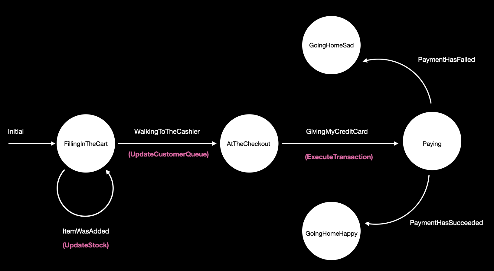

# FrenchKit 2022

**Swift concurrency and state machines: The path to modern and reliable features**

Welcome to this classroom!

The main goal is to develop your very own state machine engine thanks to Swift concurrency and use it in a SwiftUI feature. Of course, our time together is limited today, so I have pre-cooked some things for you but you will have to fill-in the gaps.

As you can see, this project is divided into a main target (the `FrenchKit2022` application) and a local package (the `StateMachinePackage`).

The `FrenchKit2022` application consists in one screen where you can put items in your shopping cart and go to the cashier to pay the bill.

The `StateMachinePackage` exposes the tools to build and execute any state machine. For now it does not compile.

**If at any step of the exercice you are stuck, you can give a look at the fully functional implementation [here](https://github.com/sideeffect-io/FrenchKit2022).**

### Step 1
Go to the `StateMachinePackage` folder and read the [README](./StateMachinePackage/README.md). It contains all the instructions to make the state machine engine work.

### Step 2
Come back to this README 😄 and follow the next steps.

### Step 3
In `Supermarket/StateMachine/Outputs`:

Implement the `ExecuteTransaction` outputs, based on what is done in `UpdateStock` or in `UpdateCustomerQueue`. Those outputs do not leak any implementation details and are meant to map the result of a side effect's execution to an optional `Event` that will be given back to the state machine.

### Step 4
In `Supermarket/StateMachine/StateMachine.swift`:

Finish the implementation of the state machine to implement all the meaningful transitions. A first transition is implemented as an example. You can refer to this diagram:

### Step 5
We now have described our state machine. We have an initial state, the transitions and the side effects to execute.
At this point you can give a look at `FrenchKit2022Tests/SupermarketTests.swift` and execute the test. If you have implemented your transitions the right way the test should pass 🟢.

### Step 6
In `FrenchKit2022App.swift`:

It is now time to implement our concrete/real-world side effects and assemble everything into a `ViewStateMachine` that the view can use.

The `makeViewStateMachine` function takes care of that. You just have to provide an implementation for the `ExecuteTransaction` side effect. You can fake any long running operation with a `try? await Task.sleep(nanoseconds:)` statement and add some logging instructions.

### Step 7:

Hold on, we're almost there. 

In `Supermarket/Views/ContentView.swift`:

We have to fire some events to feed the state machine:

- when the user clicks on the arrow to go to the cashier (line 100)
- when the user clicks on the ＄ at the checkout (line 79)
 
The state machine will automatically start when the view starts thanks to the `.task {}` modifier.

Now that every event is wired up, you can give it a try ! (you can reset your state at any moment by pressing the "reset" button in the navigation bar)

Congratulations 🥳!

### Extra steps:

For those of you that have some time left before leaving, here's a bunch of improvements you can work on:

- Keep track of the ongoing tasks in `SideEffectExecutor`

- Cancel those tasks when the `AsyncStateMachine` root task is cancelled (you can use a `withTaskCancellationHandler` in the `next()` function to catch the cancellation)

- Add some meta data in the `SideEffect` structure to handle the `TaskPriority` when executing a side effect in `SideEffectExecutor`

- Make `SideEffect` return an `AsyncSequence` of `Event` and not only an optional `Event`. That way we could have long running side effects that would emit events over time instead of a single one

- Introduce a mapper function from the `State` To a `ViewState` in `ViewStateMachine`. Doing so would allow us to compute a "ready to display" view state without having to add computed properties on the state

### Slides

You can find the slides presented in this classroom [here](https://github.com/sideeffect-io/FrenchKit2022/blob/main/Concurrency_and_statemachines.pdf).
